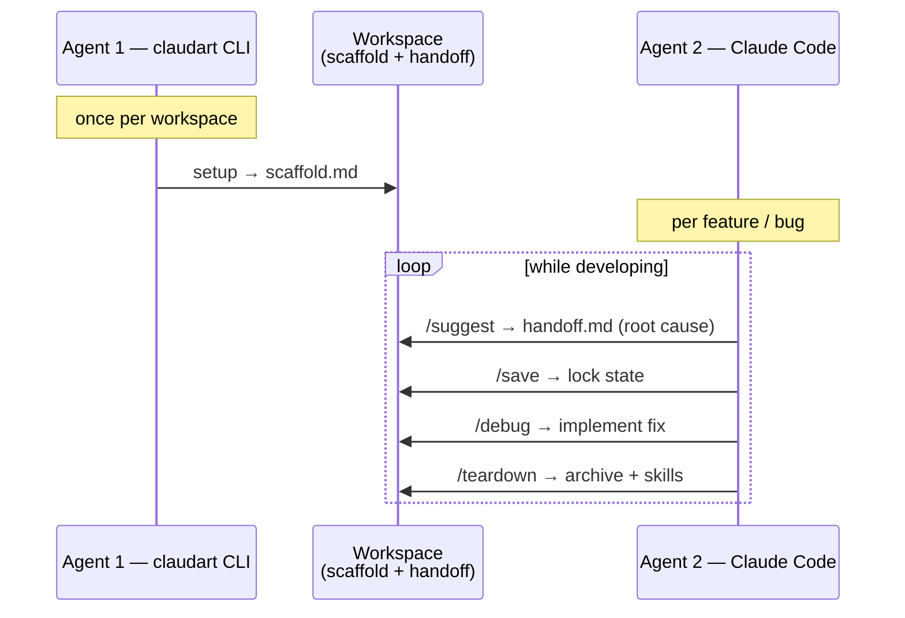
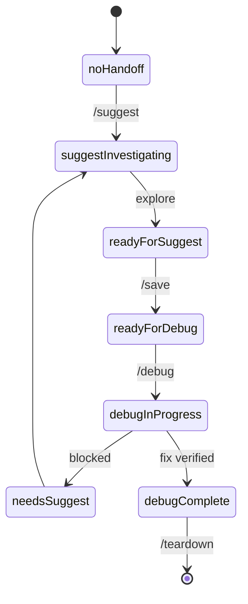
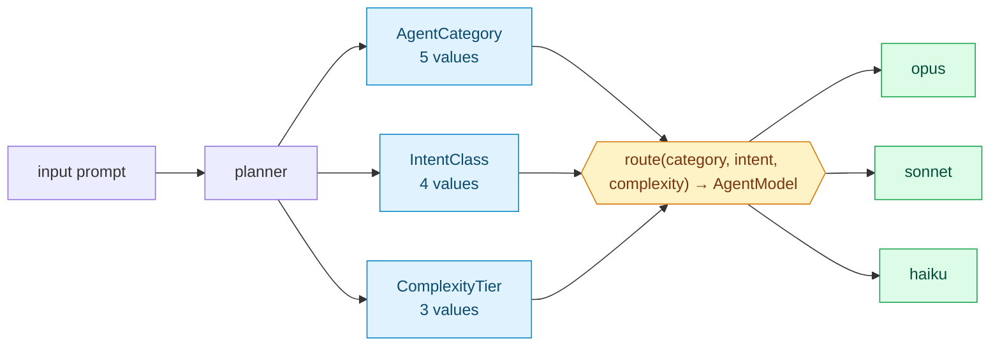
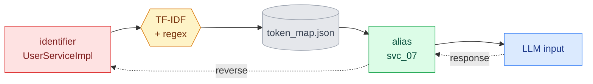
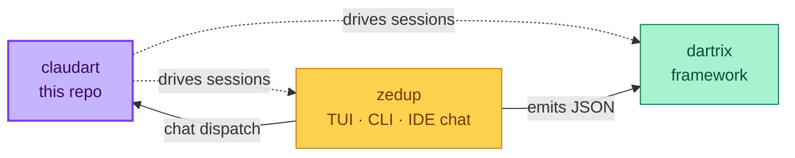

# claudart

**AI session orchestration for Claude Code. Two agents · typed handoff · deterministic model routing.**

A compiled Dart CLI that brings structured memory, typed session state, and privacy abstraction to your Claude Code workflow. The state lives on your machine; the LLM only sees what you let it.

> Not an Anthropic product. Built for Claude Code + Dart/Flutter projects.
>
> **Deep dive:** [PLAN.md](PLAN.md) carries the full architecture. [docs/design.md](docs/design.md) is the formal FSA proof.

---

## What it is

**claudart** is a CLI you run in your terminal. It manages everything *between* sessions: writing structured context before you open your editor, checkpointing discoveries mid-session, abstracting sensitive identifiers before they leave your machine, and extracting learnings when a session ends.

**Claude Code** is the AI assistant in your editor (Cursor · VS Code · any Claude-integrated IDE). You drive it through slash commands: `/suggest`, `/debug`, `/save`, `/teardown`. It reads the context claudart wrote, so every session starts already knowing the bug, the declared scope, and what has been tried.

| | claudart | Claude Code |
|---|---|---|
| **What** | Dart CLI binary at `~/bin/claudart` | AI assistant in your editor |
| **Where** | terminal | IDE chat panel |
| **You type** | `claudart setup`, `claudart teardown` | `/suggest`, `/debug`, `/save` |
| **It owns** | session state, workspace config, skills, privacy | exploration, fix implementation |
| **Runs on** | your machine only (`~/.claudart/`) | Anthropic servers (reads abstracted context) |

---

## The two-agent model



Agent 1 runs once per workspace and bakes generic knowledge into `scaffold.md`. Agent 2 inherits that scaffold every session and only loads the narrow per-feature `handoff.md`. Context windows stay task-specific.

---

## HandoffStatus — the typed state machine

The session lives in `handoff.md`, with its top-of-file `Status:` field driving everything. Replaces magic strings — every transition is a typed enum value, every dispatch is an exhaustive switch.



[`HandoffStatus`](lib/session/session_state.dart#L7) — eight values, exhaustive switch in [`teardown_utils.dart`](lib/session/teardown_utils.dart) and every dispatch.

---

## The planner — `route(category, intent, complexity) → AgentModel`

Every input the planner sees gets classified on three orthogonal axes, then routed to a model via a total function. Sixty cells, exhaustive switch.



The three axes — each a typed enum with documented invariants:

- **[`AgentCategory`](lib/pipeline/agents/categorization.dart#L25)** — `feature` · `bug` · `refactor` · `research` · `setup`
- **[`IntentClass`](lib/pipeline/agents/categorization.dart#L48)** — `explore` · `analyze` · `implement` · `document` (partition: `explore ∪ analyze ∪ implement ∪ document = IntentClass.values`)
- **[`ComplexityTier`](lib/pipeline/agents/categorization.dart#L59)** — `atomic` · `compound` · `systemic` (invariant: `atomic ∩ systemic = ∅`)

Three concrete routings:

| Input | Classification | Model |
|---|---|---|
| "implement gap cross-ref in side panel" | `feature × implement × atomic` | `sonnet` |
| "explain how this codebase handles state" | `research × explore × systemic` | `opus` |
| "what does HandoffStatus do" | `research × document × atomic` | `haiku` |

Routing rules ([`routeModel`](lib/pipeline/agents/categorization.dart#L78)):

- Systemic explore or analyze → **opus** (max capability for broad reasoning)
- Any analyze or implement → **sonnet** (balanced reasoning + generation)
- Atomic explore or any document → **haiku** (fast structured lookup)

`route` is total over all 60 cells — exhaustive switch enforces it.

---

## CLI surface

```bash
claudart setup          # bootstrap workspace, write scaffold.md
claudart status         # show session state
claudart suggest        # run suggest pipeline (agent dispatch)
claudart save           # checkpoint, lock root cause
claudart debug          # run debug pipeline (implement fix)
claudart teardown       # archive, promote skills, suggest commit
```

<details>
<summary><strong>Full command table</strong></summary>

| Command | Role | Code |
|---|---|---|
| `archives` | list session archives; resume / view | [bin/claudart.dart:79](bin/claudart.dart#L79) |
| `init` | workspace initialization | [bin/claudart.dart:81](bin/claudart.dart#L81) |
| `link` | symlink + register + setup sensitivity | [bin/claudart.dart:83](bin/claudart.dart#L83) |
| `unlink` | remove symlinks cleanly | [bin/claudart.dart:85](bin/claudart.dart#L85) |
| `setup` | start session, write handoff.md | [bin/claudart.dart:87](bin/claudart.dart#L87) |
| `status` | session state (compact for shell) | [bin/claudart.dart:91](bin/claudart.dart#L91) |
| `teardown` | archive, promote skills | [bin/claudart.dart:93](bin/claudart.dart#L93) |
| `suggest` | run suggest pipeline | [bin/claudart.dart:95](bin/claudart.dart#L95) |
| `debug` | run debug pipeline | [bin/claudart.dart:97](bin/claudart.dart#L97) |
| `flow` | experimental agent-constructed session | [bin/claudart.dart:99](bin/claudart.dart#L99) |
| `save` | checkpoint session | [bin/claudart.dart:101](bin/claudart.dart#L101) |
| `rotate` | archive, build gate, seed next from Pending Issues | [bin/claudart.dart:103](bin/claudart.dart#L103) |
| `kill` | abandon session (no skills update) | [bin/claudart.dart:105](bin/claudart.dart#L105) |
| `preflight <op>` | sync check (debug · save · test) | [bin/claudart.dart:107](bin/claudart.dart#L107) |
| `scan` | rescan for sensitive tokens | [bin/claudart.dart:110](bin/claudart.dart#L110) |
| `report` | diagnostic report, file GitHub issues | [bin/claudart.dart:125](bin/claudart.dart#L125) |
| `map` | generate token_map.md from token_map.json | [bin/claudart.dart:132](bin/claudart.dart#L132) |
| `experiment` | tee command output to experiments/ | [bin/claudart.dart:138](bin/claudart.dart#L138) |
| `compile` | rebuild the binary | [bin/claudart.dart:140](bin/claudart.dart#L140) |
| `version` | print version | [bin/claudart.dart:142](bin/claudart.dart#L142) |

</details>

---

## Skills + cosine similarity

Skills are persistent learnings extracted by `/teardown`. Each skill is a small markdown file; on `/suggest`, claudart picks the **top-k most relevant** by cosine similarity over a TF-IDF embedding:

```
score(query, skill) = (q · s) / (‖q‖ · ‖s‖)
```

Where `q` is the term-frequency vector of the user's task description and `s` is the same for the skill body. Skills with `score ≥ threshold` get injected into context. Below threshold → ignored, no token cost.

Adding a skill is automatic — `/teardown` writes it. Pruning is a manual review step in `claudart rotate`.

---

## Privacy & token efficiency

Sensitive identifiers (class names, file names, project-specific terms) get abstracted before any prompt leaves your machine. The reverse mapping resolves on response.



Token-efficiency comparison — the same task, unstructured chat vs claudart pipeline:

| Strategy | Input tokens | Output tokens | Total |
|---|---|---|---|
| Unstructured chat (one big prompt) | ~24,000 | ~3,800 | ~27,800 |
| claudart (scaffold once + per-feature handoff) | ~6,500 | ~3,200 | ~9,700 |

≈ 65% reduction. Numbers are typical, not benchmarks.

---

## Workspace structure

<details>
<summary><strong>What lives on disk</strong></summary>

```
~/.claudart/
├── workspace.json              # owner, stack, knowledge scope
├── scaffold.md                 # baked once by Agent 1
├── token_map.json              # identifier → alias map
├── projects/
│   └── <project>/
│       ├── handoff.md          # active session state
│       ├── skills.md           # promoted learnings
│       └── archive/            # rotated session archives
└── logs/
    ├── interactions.jsonl
    └── errors.jsonl
```

</details>

---

## Roadmap

<details>
<summary><strong>What's coming</strong></summary>

| Phase | Scope | Status |
|---|---|---|
| 1 | CLI + workspace + scaffold | shipped |
| 2 | Sensitivity mode + token map | shipped |
| 3 | Skills + cosine retrieval | shipped |
| 4 | Static analysis scanner | shipped |
| 5 | Design subagent | deferred — see [PLAN.md](PLAN.md) |
| 6 | Agent flow registry + planner.dart | planned |

</details>

---

## Cross-repo



claudart runs **standalone**. The dartrix and zedup integrations are optional — they consume claudart's slash commands but claudart doesn't depend on either.

---

## Philosophy

- **Typed state.** Every session field is an enum or typed record. Magic strings are bugs in waiting.
- **Deterministic routing.** `route` is total and exhaustive — no ambiguous dispatch.
- **Abstraction by default.** Sensitive identifiers leave your machine only as aliases.
- **Agent-portable.** The handoff is a single file; any Claude-integrated editor can drive a session.

---

## Related

- **[dartrix](https://github.com/liitx/dartrix)** — Test matrix framework. claudart workflows like `/suggest` and `/debug` align with dartrix's discipline of compile-time enforcement and surgical scope.
- **[zedup](https://github.com/liitx/zedup)** — TUI dashboard + work tracker. Hosts an in-editor claudart chat panel; dispatches `/suggest`, `/debug`, `/save` via the typed `AgentMode → preferredModel` registry.
