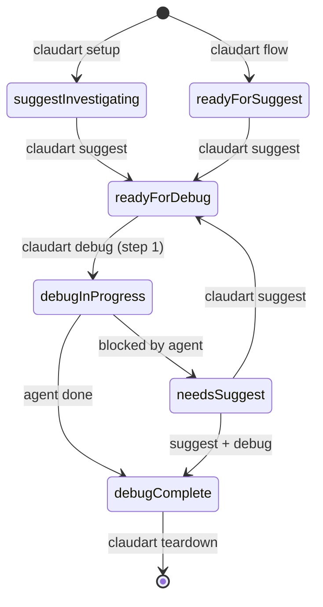
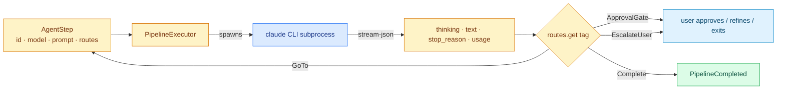
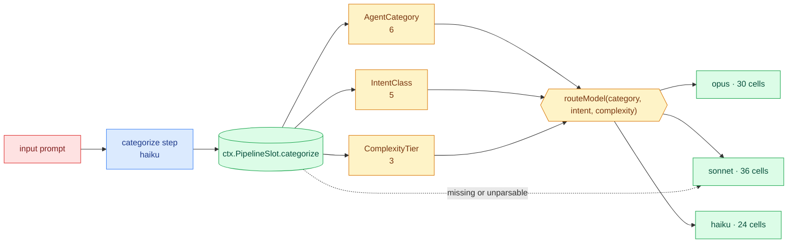
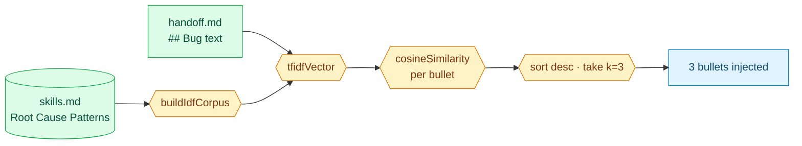
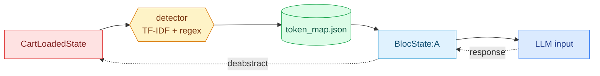
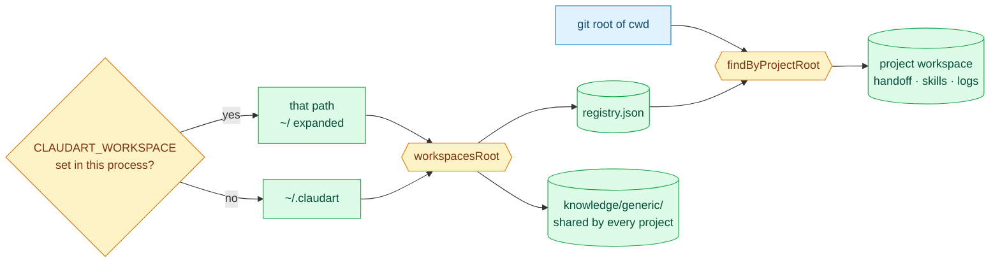
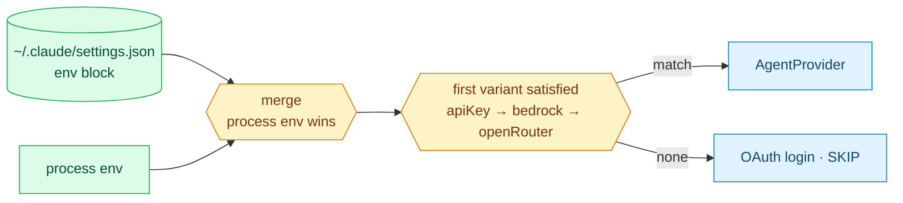
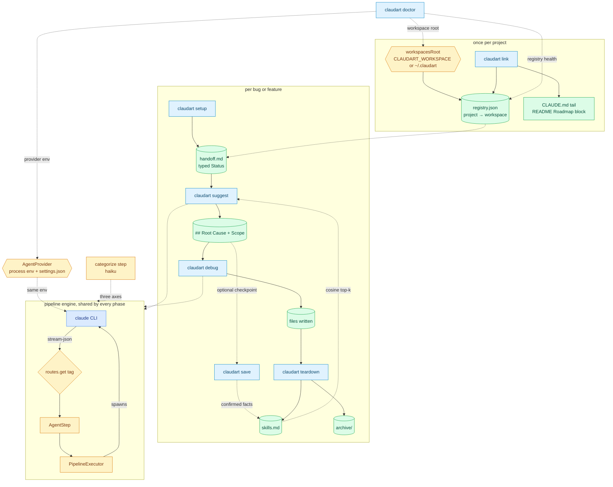
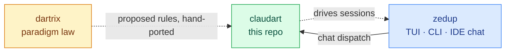

# claudart

**A typed, self-hosting session harness for Claude Code.** claudart owns the state *between* AI coding sessions, so the model always opens already knowing the bug, the scope, the root cause, and what's been tried. Session state is an enum. Model routing is a total function over 90 cells. Every claim on this page is backed by a command you can run.

> Not an Anthropic product. Built for Claude Code + Dart/Flutter projects.
>
> **Deep dive:** [PLAN.md](PLAN.md) carries the full architecture and phase log. [docs/design.md](docs/design.md) is the formal FSA proof.

---

## Contents

**Start here**
- [What it is](#what-it-is) — claudart vs Claude Code, in one table
- [Verify it yourself](#verify-it-yourself) — every number on this page, reproducible in three commands

**How one session runs**
- [The session state machine](#the-session-state-machine) — the enum that drives everything
- [The handoff](#the-handoff) — the one file both sides read and write
- [The pipeline engine](#the-pipeline-engine) — what `suggest`/`debug`/`flow` actually share
- [Model routing](#model-routing) — the 90-cell function deciding haiku vs sonnet vs opus

**Supporting systems**
- [Skills + retrieval](#skills--retrieval) — cosine top-k over past root causes
- [Token abstraction](#token-abstraction) — identifiers get aliased before any prompt leaves your machine
- [Templates and generated documents](#templates-and-generated-documents) — the splice-not-clobber contract
- [Lint enforcement](#lint-enforcement) — paradigm rules as compiled checks, not prose

**Where you touch it**
- [CLI surface](#cli-surface) — every command, verified against real `--help` output, plus what `claudart doctor` checks
- [Workspace on disk](#workspace-on-disk) — the one file startup reads, and everything it points to
- [TUI vs CLI](#tui-vs-cli) — the same typed state, rendered two ways
- [Authentication](#authentication) — how a pipeline step stays logged in as you

**Reference**
- [Full architecture](#full-architecture) — the three-layer diagram tying it all together
- [Roadmap](#roadmap)
- [Cross-repo](#cross-repo) — claudart's relationship to dartrix and zedup
- [Related](#related)

---

## What it is

**claudart** is a compiled Dart CLI. It writes structured context before you open your editor, checkpoints discoveries mid-session, abstracts sensitive identifiers before they leave your machine, and extracts learnings when a session ends.

**Claude Code** is the assistant in your editor. You drive it through `/suggest`, `/debug`, `/save`, `/teardown`. It reads what claudart wrote, so it never starts blind.

| | claudart | Claude Code |
|---|---|---|
| **What** | Dart CLI binary at `~/bin/claudart` | AI assistant in your editor |
| **Where** | terminal | IDE chat panel |
| **You type** | `claudart setup`, `claudart teardown` | `/suggest`, `/debug`, `/save` |
| **It owns** | session state, workspace config, skills, privacy | exploration, fix implementation |
| **Runs on** | your machine only (`~/.claudart/`) | Anthropic servers, reading abstracted context |

Self-hosting law, from this repo's own CLAUDE.md: claudart must be able to debug its own bugs using its own workflow. This README was rewritten by a `claudart debug` run against a handoff that `claudart suggest` wrote.

---

## Verify it yourself

Three commands. Real output, captured 2026-09-27 on `main`.

```
$ dart test
...
00:02 +1181: All tests passed!

$ dart run custom_lint
Analyzing...

No issues found!

$ claudart status

═══════════════════════════
  CLAUDART SESSION STATUS
═══════════════════════════

Project  : claudart
Branch   : main
Status   : ready-for-debug
Bug      : README.md was extended incrementally this session rather than genuinely redesign…
Root cause: README.md is 563 lines of accreted sections, not a designed document. Three defe…

Relevant past patterns:
  - **general**: Documentation was extended incrementally rather than redesigned holistically…
  - **symlink-management**: CLI registration crashes when it unconditionally attempts to crea…
  - **configuration**: User reconsidered the model assignment for a request-class routing dec…

Handoff  : …/claudart/handoff.md
Skills   : …/claudart/skills.md

Next step:
  Run /debug in your editor.
```

1181 tests across 81 files. The count includes this page: the README-sync group registers one test per distinct `claudart` subcommand the prose names. `custom_lint` runs this repo's three hand-written paradigm rules over `lib/`, `bin/`, and `test/`. `claudart status` is read-only — safe to run anywhere inside a linked project.

Line coverage has its own gate. `make test-coverage` runs the suite with `--coverage` and formats the result to `coverage/lcov.info` (one-time setup on a fresh machine: `dart pub global activate coverage`). `make check-coverage` depends on it, then hands the tracefile to [`tool/check_coverage.dart`](tool/check_coverage.dart), which sums its `LF:`/`LH:` totals and exits 1 below the floor — no `lcov` system package, no extra pub dependency. Captured 2026-10-02:

```
$ make check-coverage
…
dart run tool/check_coverage.dart 74.0
Line coverage 76.3% meets the 74.0% floor (3131/4101 lines).
```

The floor is a measured baseline with headroom, not a target. 74.0 sits roughly two points under what this repo actually measures on more than one machine; a floor one rounding error below the real number fails on the next machine for reasons that are not regressions. It exists to catch coverage sliding backwards, and moves up only when measured coverage does.

---

## The session state machine

A session is a state machine, not a chat log. `claudart setup` writes a `handoff.md` whose `## Status` section holds one of six canonical strings. Every command that touches that file parses the string into [`HandoffStatus`](lib/session/session_state.dart#L7), decides what is legal next, and writes a new one back. No free text drives control flow anywhere in the loop.


```mermaid
stateDiagram-v2
  [*] --> suggestInvestigating: claudart setup
  [*] --> readyForSuggest: claudart flow
  suggestInvestigating --> readyForDebug: claudart suggest
  readyForSuggest --> readyForDebug: claudart suggest
  needsSuggest --> readyForDebug: claudart suggest
  readyForDebug --> debugInProgress: claudart debug (step 1)
  debugInProgress --> needsSuggest: blocked by agent
  debugInProgress --> debugComplete: agent done
  needsSuggest --> debugComplete: suggest + debug
  debugComplete --> [*]: claudart teardown
```

`HandoffStatus` has eight variants. Six are persisted to disk; two never are:

| Variant | On-disk value | Written by | Meaning |
|---|---|---|---|
| `suggestInvestigating` | `suggest-investigating` | `claudart setup` | bug captured, root cause unknown |
| `readyForSuggest` | `ready-for-suggest` | `claudart flow` construct step | agent-built handoff, investigation still open |
| `readyForDebug` | `ready-for-debug` | `claudart suggest` | root cause locked, fix not written |
| `debugInProgress` | `debug-in-progress` | agent (`/debug`) | fix underway |
| `debugComplete` | `debug-complete` | `claudart debug` | edits on disk, awaiting verification |
| `needsSuggest` | `needs-suggest` | agent (`/debug` blocked) | debug hit a wall, bounce back |
| `noHandoff` | — | never | zedup-local: no handoff file at all |
| `unknown` | — | never | unparsable Status section |

The typed value is what dispatch switches on. [`lib/commands/status.dart`](lib/commands/status.dart#L103) carries two exhaustive switches over all eight — next-step advice and terminal colour. Adding a ninth variant is a compile error at both sites, not a runtime surprise.

Precondition enforcement is explicit, not implied. `claudart debug` prints a warning if the status is not exactly `ready-for-debug`, then calls `confirm('Run debug anyway?')` — a soft gate. `claudart suggest` detects that suggest already ran, asks before overwriting, and archives the existing handoff first.

---

## The handoff

`handoff.md` is the single artifact both sides read and write. [`lib/templates/handoff_template.dart`](lib/templates/handoff_template.dart) renders nine top-level sections in a fixed order, and both writers address them by name through `readSection`/`updateSection` in [`lib/md_io.dart`](lib/md_io.dart) — never by offset.

| Section | Written by | Read by |
|---|---|---|
| `## Status` | setup, suggest, debug | every command |
| `## Bug` | setup | suggest, debug, skills retrieval |
| `## Expected Behavior` | setup | suggest, debug |
| `## Root Cause` | suggest | debug |
| `## Scope` | setup, suggest | suggest, debug (four subsections, including **Must not touch**) |
| `## Constraints` | setup, suggest | debug |
| `## Debug Progress` | debug | suggest, teardown (four subsections, ending in **Specific question for suggest**) |
| `## Suggest Resume Notes` | suggest | suggest |
| `## Pending Issues` | any | `claudart rotate` seeds the next session from the first unchecked item |

Classification is deliberately *not* a handoff section. Both `suggest` and `debug` run their own Phase 0 categorize step (haiku) rather than one persisting it for the other to read — the only thing persistence would buy is skipping one cheap haiku call, against a real cost: `Bug`/`Root Cause` can change between the two commands, and a persisted classification would silently go stale while still being trusted. Classification was built as a handoff section in Phase 13, then reverted 2026-09-27 after recognizing this stale-cache problem. See [Model routing](#model-routing).

---

## The pipeline engine

`suggest`, `debug`, and `flow` are all the same engine handed a different list of steps. An [`AgentStep`](lib/pipeline/agent_step.dart#L42) declares its id, label, model, system prompt, prompt builder, and a routing table. [`PipelineExecutor`](lib/pipeline/pipeline_executor.dart) spawns the real `claude` CLI as a subprocess per step, parses `--output-format stream-json --include-partial-messages`, and follows the route. What happens after a step lives in a `Map<RouteTag, StepRoute>` that compiles, not in prose and not in the model's head.


```mermaid
flowchart LR
  Step[AgentStep<br/>id · model · prompt · routes]:::fn --> Exec[PipelineExecutor]:::fn
  Exec -->|spawns| CLI[claude CLI subprocess]:::ext
  CLI -->|stream-json| Parse[thinking · text · stop_reason · usage]:::fn
  Parse --> Route{routes.get tag}:::fn
  Route -->|GoTo| Step
  Route -->|ApprovalGate| User[user approves / refines / exits]:::cmd
  Route -->|EscalateUser| User
  Route -->|Complete| Done[PipelineCompleted]:::state
  classDef state fill:#dcfce7,color:#064e3b,stroke:#16a34a
  classDef cmd fill:#e0f2fe,color:#0c4a6e,stroke:#0284c7
  classDef fn fill:#fef3c7,color:#78350f,stroke:#d97706
  classDef ext fill:#dbeafe,color:#1e3a8a,stroke:#3b82f6
```

Four typed pieces, each closed:

- **[`RouteTag`](lib/pipeline/route_tag.dart#L25)**, six variants — `PLAN`, `QUESTION`, `ANSWER`, `UNKNOWN`, `HANDOFF`, `CHANGES`. The wire string lives on the enum constructor, so renaming a tag is one line.
- **[`StepRoute`](lib/pipeline/step_route.dart#L17)**, a sealed class with four variants — `GoTo`, `EscalateUser`, `ApprovalGate`, `Complete`.
- **[`PipelineEvent`](lib/pipeline/pipeline_event.dart#L30)**, a sealed hierarchy of eight — `AgentStarted`, `AgentCompleted`, `AgentFailed`, `AgentEscalating`, `AgentResumed`, `PlanDraft`, `AwaitingApproval`, `PipelineCompleted`. This is the executor's real lifecycle model.
- **[`StepStatus`](lib/pipeline/step_status.dart#L28)**, five variants — the UI-facing projection of that event stream, derived once by `StepStatusFromEvent.fromEvent` rather than re-derived per consumer.

The two shipped pipelines:

| Phase | Steps | Model |
|---|---|---|
| `claudart suggest` | `categorize` → `reader` → `reasoner` → write handoff | haiku → haiku → **routed** (sonnet default) |
| `claudart suggest` refinement | `planner` → `lookup` → `applier`, looped per pass | sonnet → haiku → haiku |
| `claudart debug` | `categorize` → `reader` → `implementer` → write files | haiku → haiku → **routed** (sonnet default) |

The refinement loop is section-scoped. When you ask for a change, the applier sends and receives only the analysis sections your feedback targets, not the full document round-tripped every pass. A targeted section that does not exist yet falls back to the full document rather than silently dropping the edit.

<details>
<summary><strong>Extended thinking, captured and attributed</strong></summary>

`defaultClaudeRunner` parses the real partial-message stream, not just the final summary line. A captured call:

```
text: 9 times 8 equals **72**...
thinking present: true
thinking (first 200 chars): The user is asking me to calculate 9 times 8...
thinkingTokens: 240
stopReason: end_turn
durationMs: 4528
numTurns: 1
usage: Usage(in:9, out:439, cached:10386, cacheWrite:6698, thinking:240, $0.0122881)
```

240 of the 439 output tokens went to reasoning the model never showed. Attributed and queryable, not silently discarded.

</details>

---

## Model routing

Every input is classified on three orthogonal axes, then routed by a total function. The three axis enums and the routing switch live in [`lib/pipeline/agents/categorization.dart`](lib/pipeline/agents/categorization.dart). A fourth enum, [`CategorizeTag`](lib/pipeline/agents/categorization.dart#L31), defines the wire protocol (the XML tag names emitted by the categorize step).


```mermaid
flowchart LR
  In[input prompt]:::raw --> Cat[categorize step<br/>haiku]:::ext
  Cat --> Slot[(ctx.PipelineSlot.categorize)]:::state
  Slot --> A[AgentCategory<br/>6]:::fn
  Slot --> I[IntentClass<br/>5]:::fn
  Slot --> C[ComplexityTier<br/>3]:::fn
  A & I & C --> T{{"routeModel(category, intent, complexity)"}}:::fn
  T --> Op[opus · 30 cells]:::state
  T --> So[sonnet · 36 cells]:::state
  T --> Hk[haiku · 24 cells]:::state
  Slot -.->|missing or unparsable| So
  classDef state fill:#dcfce7,color:#064e3b,stroke:#16a34a
  classDef cmd fill:#e0f2fe,color:#0c4a6e,stroke:#0284c7
  classDef fn fill:#fef3c7,color:#78350f,stroke:#d97706
  classDef ext fill:#dbeafe,color:#1e3a8a,stroke:#3b82f6
  classDef raw fill:#fee2e2,color:#7f1d1d,stroke:#dc2626
```

- **[`AgentCategory`](lib/pipeline/agents/categorization.dart#L148)** — `feature`, `bug`, `refactor`, `research`, `setup`, `gui`.
- **[`IntentClass`](lib/pipeline/agents/categorization.dart#L188)** — `explore`, `analyze`, `implement`, `document`, `design`.
- **[`ComplexityTier`](lib/pipeline/agents/categorization.dart#L217)** — `atomic`, `compound`, `systemic`.
- **[`CategorizeTag`](lib/pipeline/agents/categorization.dart#L31)** — `category`, `intent`, `complexity`, `model`. The wire protocol: four XML tags the categorize step emits, extracted by tag name and normalized to enum variants.

[`routeModel`](lib/pipeline/agents/categorization.dart#L251) is one exhaustive switch with three grouped arms:

1. Any `design` intent, or systemic `explore`/`analyze` → **opus**.
2. Any `analyze` or `implement`, or compound `explore` → **sonnet**.
3. Atomic `explore`, or any `document` → **haiku**.

[`modelForCategorizeOutput`](lib/pipeline/agents/categorization.dart#L287) extracts the three tags from a categorize step's raw output and consults `routeModel`. When any tag is missing or names a value that is not a real enum variant, it returns the caller's fallback — sonnet for both shipped selectors. `suggest` and `debug` each run their own categorize step rather than one persisting the result for the other — see [The handoff](#the-handoff) for why.

<details>
<summary><strong>Verified: the full 90-cell sweep and the fallback path</strong></summary>

Every cell enumerated through the real `routeModel`, then the real `modelForCategorizeOutput` on three inputs:

```
cells covered: 90
  haiku   24
  sonnet  36
  opus    30

feature × implement × atomic → sonnet
research × explore × systemic → opus
research × document × atomic → haiku
gui × design × atomic → opus

modelForCategorizeOutput(gui/design/systemic) → opus
modelForCategorizeOutput("")                  → sonnet
modelForCategorizeOutput("garbage, no xml tags") → sonnet
```

The last two lines are the ones that matter in practice: both `suggest` and `debug` always run a real categorize step, so an empty or unparsable slot only happens on a genuine API failure or a malformed model response — and either way it degrades to sonnet, never to haiku. Misrouting complex work down is worse than paying for sonnet.

</details>

Four models are registered in [`lib/pipeline/agent_model.dart`](lib/pipeline/agent_model.dart#L58), each carrying its own slug, display name, context window, output cap, tier, and identity predicates. The [`ModelTier`](lib/pipeline/agent_model.dart#L39) enum classifies speed vs capability. Each [`AgentModel`](lib/pipeline/agent_model.dart#L62) variant carries `contextWindow` and `maxOutputTokens` fields (in tokens), and identity predicates: [`bestForLookup`](lib/pipeline/agent_model.dart#L146), [`bestForAnalysis`](lib/pipeline/agent_model.dart#L147), [`bestForExplore`](lib/pipeline/agent_model.dart#L148) (true for the default route within that intent class). Every place a model is displayed — this table, the TUI panes below, the CLI's own status output — shows [`shortName`](lib/pipeline/agent_model.dart#L127), the full `<name>-<version>` form. No shorthand alias exists anywhere in the codebase.

| Variant | Display name | Slug | Tier | Context window | Max output | Routed to |
|---|---|---|---|---|---|---|
| `haiku` | `haiku-4.5` | `claude-haiku-4-5-20251001` | fast | 200,000 | 8,192 | 24 cells |
| `sonnet` | `sonnet-5` | `claude-sonnet-5` | balanced | 200,000 | 16,000 | 36 cells |
| `opus` | `opus-5.5` | `claude-opus-5-5` | capable | 200,000 | 32,000 | 30 cells |
| `fable` | `fable-5.1` | `claude-fable-5-1` | capable | 200,000 | 32,000 | 0 cells |

`fable` is a real, registered model. `routeModel`'s design branch pointed at it briefly, then moved to opus the same day after comparing output quality directly. It stays in the registry and is usable by name; it is not the default route for anything today.

The identity predicates (`bestForLookup`, etc.) return true based on enum membership, not tier — a design documented in `agent_model.dart:140-145` to keep the predicates simple and exhaustive, side-stepping any tier/routing mismatch.

Cost tradeoff, stated plainly: Phase 0 adds one haiku categorize call to every `suggest` session, including ones that would have routed to sonnet anyway. The net win is real only for the fraction of sessions that are atomic or lookup-shaped and would otherwise overpay for a fixed sonnet reasoner. This is architecturally correct, not benchmarked against real session-mix data.

---

## Skills + retrieval

Skills are persistent learnings that `claudart teardown` extracts and appends to `skills.md` under `## Root Cause Patterns`. On `claudart suggest` and `claudart status`, claudart surfaces the most relevant ones by TF-IDF cosine similarity.

```
score(query, pattern) = (q · p) / (‖q‖ · ‖p‖)
```


```mermaid
flowchart LR
  Bug[handoff.md<br/>## Bug text]:::state --> V{{tfidfVector}}:::fn
  Skills[(skills.md<br/>Root Cause Patterns)]:::state --> Corpus{{buildIdfCorpus}}:::fn
  Corpus --> V
  V --> Cos{{cosineSimilarity<br/>per bullet}}:::fn
  Cos --> Sort{{sort desc · take k=3}}:::fn
  Sort --> Inject[3 bullets injected]:::cmd
  classDef state fill:#dcfce7,color:#064e3b,stroke:#16a34a
  classDef cmd fill:#e0f2fe,color:#0c4a6e,stroke:#0284c7
  classDef fn fill:#fef3c7,color:#78350f,stroke:#d97706
  classDef ext fill:#dbeafe,color:#1e3a8a,stroke:#3b82f6
```

**This is strict top-k, not thresholding.** [`relevantSkillPatterns`](lib/session/skills_lookup.dart#L23) splits the section into one chunk per bullet, builds the IDF corpus from the patterns themselves, and delegates to [`topKChunks`](lib/similarity/cosine.dart#L64), which sorts by score and calls `.take(k)` with `k = 3`. There is no score floor anywhere in the path. A bullet scoring 0.0 is still injected whenever fewer than three patterns exist.

<details>
<summary><strong>Verified: top-k has no floor</strong></summary>

Two runs of the real `relevantSkillPatterns`. The second uses a skills file whose bullets share no terms at all with the query:

```
k=3 over 4 bullets, query "symlink already exists":
  - **symlink-management**: CLI crashes creating a file that already exists.
  - **configuration**: routing decision reconsidered after output comparison.
  - **parser**: XML tag extraction returns null on a hallucinated enum value.

k=3 over 2 unrelated bullets, query "symlink already exists":
  returned 2 of 2 — zero-scoring bullets included:
  - **zebra**: totally unrelated bullet about grazing mammals.
  - **quasar**: totally unrelated bullet about radio astronomy.
```

The ranking is real; the filtering is not. Cost is bounded by `k`, not by relevance.

</details>

Adding a skill is automatic — `claudart teardown` writes it. Pruning is a manual review step in `claudart rotate`.

---

## Token abstraction

Project-specific identifiers are replaced with typed aliases before any prompt leaves your machine, and restored on the way back. [`SensitivityDetector`](lib/sensitivity/detector.dart) combines a TF-IDF corpus of common Dart/Flutter terms with three identifier regexes (PascalCase, camelCase, snake_case); anything absent from the corpus has high IDF and is treated as sensitive. [`Abstractor`](lib/sensitivity/abstractor.dart) infers a type prefix from the suffix (`Bloc`, `Cubit`, `Repository`, `Widget`, `Provider`, …) and [`TokenMap`](lib/sensitivity/token_map.dart) assigns a sequential alias per prefix, persisted to `token_map.json`.


```mermaid
flowchart LR
  Id[CartLoadedState]:::raw --> D{{detector<br/>TF-IDF + regex}}:::fn
  D --> M[(token_map.json)]:::state
  M --> Al[BlocState:A]:::cmd
  Al --> LLM[LLM input]:::ext
  LLM -.->|response| Al
  Al -.->|deabstract| Id
  classDef state fill:#dcfce7,color:#064e3b,stroke:#16a34a
  classDef cmd fill:#e0f2fe,color:#0c4a6e,stroke:#0284c7
  classDef fn fill:#fef3c7,color:#78350f,stroke:#d97706
  classDef ext fill:#dbeafe,color:#1e3a8a,stroke:#3b82f6
  classDef raw fill:#fee2e2,color:#7f1d1d,stroke:#dc2626
```

<details>
<summary><strong>Verified: a real round trip</strong></summary>

```
in     : UserServiceImpl calls CheckoutRepository, then CartBloc emits CartLoadedState.
out    : Class:A calls Repository:A, then Bloc:A emits BlocState:A.
back   : UserServiceImpl calls CheckoutRepository, then CartBloc emits CartLoadedState.
mapped : 4 identifiers
```

Four identifiers, four type prefixes inferred from suffix, byte-identical restore. Deprecated tokens are never reassigned, so an alias in an old archive still resolves.

</details>

`claudart scan` re-scans a project for new sensitive tokens; [`lib/scanner/scanner.dart`](lib/scanner/scanner.dart) raises when a scan crosses its configured threshold. `claudart map` renders `token_map.json` to a readable `token_map.md`. Abstraction is opt-in per workspace, via `sensitivityMode` in `workspace.json`.

Structuring the session context also cuts raw volume — a scaffold written once plus a per-feature handoff, instead of one large unstructured prompt. That effect is real but **not measured here**, and no benchmark figure is published on this page. Run `claudart --debug` to get a per-step trace of system prompt, message, token counts, and cost written to `$CLAUDART_DEBUG_PATH`, and measure it on your own workload.

---

## CLI surface

```bash
claudart                # interactive launcher
claudart setup          # bootstrap workspace, write handoff.md
claudart status         # show session state (read-only)
claudart suggest        # classify, read scope, reason, lock root cause
claudart save           # checkpoint, deposit confirmed facts to skills
claudart debug          # read scope, implement fix, write files
claudart teardown       # archive, promote skills, suggest commit
claudart doctor         # check this machine: tools, auth, provider, workspace, registry
```

[`ClaudartCommand`](lib/commands/claudart_command.dart#L11) has 24 variants and is the single source of truth for dispatch. `version` is deliberately not a variant — it is handled and exits before dispatch runs, so a variant would be permanently unreachable. That makes 25 reachable entry points.

<details>
<summary><strong>Full command table, one row per dispatch arm</strong></summary>

| Command | Role | Dispatch |
|---|---|---|
| `chat` | interactive chat shell, the agentflow front door | [bin/claudart.dart:118](bin/claudart.dart#L118) |
| `archives` | list session archives, resume or view a snapshot | [bin/claudart.dart:120](bin/claudart.dart#L120) |
| `add` | scaffold a brand-new project: PLAN.md, CLAUDE.md, registry entry, symlink | [bin/claudart.dart:122](bin/claudart.dart#L122) |
| `init` | initialize the workspace with starter knowledge | [bin/claudart.dart:124](bin/claudart.dart#L124) |
| `link` | symlink workspace into a project, register it, regenerate doc tails | [bin/claudart.dart:126](bin/claudart.dart#L126) |
| `unlink` | remove workspace symlinks cleanly | [bin/claudart.dart:128](bin/claudart.dart#L128) |
| `setup` | start a session, write handoff.md | [bin/claudart.dart:130](bin/claudart.dart#L130) |
| `status` | session state; `--prompt` emits a compact string for RPROMPT/PS1 | [bin/claudart.dart:134](bin/claudart.dart#L134) |
| `teardown` | archive, promote skills, suggest a commit; `--headless` decides everything itself | [bin/claudart.dart:136](bin/claudart.dart#L136) |
| `suggest` | run the suggest pipeline | [bin/claudart.dart:140](bin/claudart.dart#L140) |
| `debug` | run the debug pipeline | [bin/claudart.dart:142](bin/claudart.dart#L142) |
| `flow` | experimental agent-constructed session | [bin/claudart.dart:144](bin/claudart.dart#L144) |
| `save` | checkpoint the session, deposit confirmed facts | [bin/claudart.dart:146](bin/claudart.dart#L146) |
| `rotate` | archive, run the build gate, seed the next handoff from Pending Issues | [bin/claudart.dart:148](bin/claudart.dart#L148) |
| `kill` | abandon the session, no skills update | [bin/claudart.dart:150](bin/claudart.dart#L150) |
| `resume` | pre-populate setup from the most recent archive entry | [bin/claudart.dart:152](bin/claudart.dart#L152) |
| `confirm-pending` | set or clear the workspace's pending confirmation | [bin/claudart.dart:154](bin/claudart.dart#L154) |
| `preflight` | sync check before `debug`, `save`, or `test` | [bin/claudart.dart:156](bin/claudart.dart#L156) |
| `scan` | re-scan the project for sensitive tokens | [bin/claudart.dart:159](bin/claudart.dart#L159) |
| `report` | diagnostic report; `--file-issue` files GitHub issues | [bin/claudart.dart:174](bin/claudart.dart#L174) |
| `map` | generate token_map.md from token_map.json | [bin/claudart.dart:182](bin/claudart.dart#L182) |
| `experiment` | run a command and tee its output to `experiments/` | [bin/claudart.dart:189](bin/claudart.dart#L189) |
| `compile` | rebuild the binary and install it to `~/bin/claudart` | [bin/claudart.dart:191](bin/claudart.dart#L191) |
| `doctor` | fresh-machine check: tools, git identity, `gh` auth, provider env, workspace root, registry, PATH | [bin/claudart.dart:193](bin/claudart.dart#L193) |
| `version` | print the version, before dispatch | [bin/claudart.dart:97](bin/claudart.dart#L97) |

</details>

<details>
<summary><strong>Verified <code>--help</code> output</strong></summary>

Captured from `dart run bin/claudart.dart --help`, not retyped. Every command in the table above appears here, and every line here maps to a dispatch arm.

```
claudart — Dart CLI for structured project debug and suggestion sessions

Usage:
  claudart                Run the interactive launcher (list projects, start workflow)
  claudart <command> [arguments]

Commands:
  chat                   Open the interactive chat shell: greeting, then dispatch to flow/suggest
  archives               List session archives for the current project; resume or view snapshots
  add                    Scaffold a brand-new project: PLAN.md, CLAUDE.md, registry entry, .claude symlink, Claude Code memory registration
  init                   Initialize the workspace with generic starter knowledge
  init --project <name>  Add a project knowledge file to the workspace
  link [project-name]    Symlink workspace into current project (detects name from git if omitted); --sensitive / --no-sensitive set sensitivity mode without asking
  unlink                 Remove workspace symlinks from current project
  setup [path]           Start a new session (path defaults to current directory)
  status [--prompt]      Show current session state; --prompt outputs a compact colored string for shell RPROMPT/PS1
  teardown [--headless]  Close session: update knowledge, archive handoff, suggest commit; --headless resolves every decision itself and prints a summary instead of prompting
  suggest                Run suggest pipeline: haiku classifies the bug and reads scope files, routed model writes handoff KT
  debug                  Run debug pipeline: haiku reads scope files, routed model emits EDIT_FILE edits written to disk
  flow                   [experimental] Agent-constructed session: classify intent, plan, approve, build handoff
  save                   Checkpoint session: snapshot handoff, deposit confirmed facts to skills
  rotate [--headless]    Archive current session, run build gate, seed next handoff from Pending Issues; --headless skips the confirmation (needed when there is no terminal to ask on)
  kill [--headless]      Abandon session: archive handoff, remove symlink (no skills update); --headless skips the confirmation but never clears a workspace lock
  resume                 Pre-populate setup from the most recent archive entry
  confirm-pending --question <q> --on-confirm <cmd>
                         Set the pending confirmation for this workspace
  confirm-pending --clear  Clear the pending confirmation
  preflight <op>         Sync check before starting an operation (op: debug | save | test)
  scan [--scope lib|full|handoff] [--full]  Re-scan project for sensitive tokens
  report [--file-issue]  Show diagnostic report; --file-issue files GitHub issues
  map                    Generate token_map.md from token_map.json
  experiment <name> -- <cmd> [args]  Run a command and tee output to experiments/<name>_<ts>.ansi
  compile                Recompile the claudart binary and install it to ~/bin/claudart
  doctor                 Fresh-machine verification: tools on PATH, git identity, gh auth, provider env
  version                Print the current claudart version

Options:
  -h, --help       Show this help message
  --version        Print the current claudart version
  --debug          Write per-step trace (system prompt, message, token
                   counts, cost) to $CLAUDART_DEBUG_PATH (default
                   /tmp/claudart_debug.log). Same effect as setting
                   CLAUDART_DEBUG=1.
```

</details>

**`claudart doctor` checks the machine, not the session.** It runs ten checks, prints one `[OK]`/`[SKIP]`/`[FAIL]` line each, and exits 1 if any failed — skip-only is exit 0. Every check re-reads live state, so it is safe to re-run after fixing something. Check identity and outcome are both enums, [`HarnessCheckId`](lib/harness/harness_check.dart#L15) and [`HarnessCheckResult`](lib/harness/harness_check.dart#L60); the checks themselves live in [`lib/commands/doctor.dart`](lib/commands/doctor.dart). Real output from this machine, user identity and home path elided:

```
$ claudart doctor
[OK] tools: git, gh, claude all on PATH
[OK] git identity: … <…>
[OK] gh auth: active login found
[SKIP] provider env: no provider found in this process's environment or ~/.claude/settings.json — fine for OAuth login
[OK] workspace root: CLAUDART_WORKSPACE=/…/dev_tools/claude
[OK] registry health: 7 entries, all projectRoots exist
[OK] path configuration: /…/bin is on PATH
[SKIP] bedrock metadata guard: not using Bedrock
[SKIP] bedrock credentials: not using Bedrock
[OK] git hooks: core.hooksPath=.githooks
```

| Check | `[OK]` | `[SKIP]` | `[FAIL]` |
|---|---|---|---|
| `tools` | `git`, `gh`, `claude` all resolve on PATH | — | names whichever are missing |
| `git identity` | `user.name` and `user.email` set, as seen from the current directory | — | either is unset |
| `gh auth` | `gh auth status` exits 0 | — | no active login |
| `provider env` | an [`AgentProvider`](#authentication) is configured | none found — normal for OAuth login | — |
| `workspace root` | `CLAUDART_WORKSPACE` set, exists, and no second registry at `~/.claudart` | override unset; the `~/.claudart` fallback is in use | override path missing, or override set **and** `~/.claudart/registry.json` also exists |
| `registry health` | registry parses and every `projectRoot` still exists | no registry, empty file, or no entries yet | unparsable JSON, or stale entries (named) |
| `path configuration` | `~/bin` is on PATH | — | `~/bin` missing, so a binary from `claudart compile` is unreachable |
| `bedrock metadata guard` | Bedrock active and `AWS_EC2_METADATA_DISABLED=true` | Bedrock is not the active provider | Bedrock active, flag unset — see [below](#authentication) for why this matters |
| `bedrock credentials` | Bedrock active and a bounded `aws sts get-caller-identity` resolves | Bedrock not active, or `aws` CLI not installed | call fails or exceeds its 10s timeout |
| `git hooks` | project has `.githooks/` and `core.hooksPath` points at it | no `.githooks/` in this project | `.githooks/` exists but `core.hooksPath` isn't set to it |

The bedrock checks are gated on which provider `claude auth status` itself reports as active ([`AgentProvider.detectFromAuthStatusJson`](lib/providers/agent_provider.dart)) — ground truth from the real CLI, not an inference from which env vars happen to be set. **Measured, not assumed:** a Bedrock profile that can't supply credentials doesn't fail fast on a non-EC2 host — the AWS SDK falls through to probing the EC2 instance metadata service and stalls, measured at **740 seconds (~12.3 minutes)** before erroring, versus under 2 seconds with `AWS_EC2_METADATA_DISABLED=true` set. That's indistinguishable from a hang to anyone watching; `bedrock metadata guard` exists specifically to catch its absence before it bites. The credentials preflight never prints the resolved account ID/ARN, only whether it resolved.

`git hooks` exists because `.git/hooks/` is never committed — a real pre-push check (like this repo's own, see [Lint enforcement](#lint-enforcement)) only protects the machine that wrote it unless something points git at a tracked directory instead. `claudart link` sets `core.hooksPath` automatically; this check catches a project linked before that existed, or linked by something other than claudart.

`workspace root` and `registry health` catch different failures. The first asks *which* registry this process reads, and whether a second one exists that other processes would read instead — see [Workspace on disk](#workspace-on-disk). The second asks whether the registry it reads is intact. `Registry.load` deliberately swallows a JSON parse error and returns an empty registry, so doctor re-reads the raw file first; a corrupt registry fails loudly instead of looking like a fresh one. Pointing the override at a directory holding a truncated `registry.json`:

```
$ CLAUDART_WORKSPACE=/tmp/doctor_demo_ws claudart doctor
…
[OK] workspace root: CLAUDART_WORKSPACE=/tmp/doctor_demo_ws
[FAIL] registry health: registry.json exists at /tmp/doctor_demo_ws but failed to parse — back it up and investigate before linking anything new
…
$ echo $?
1
```

Each run is logged through `SessionLogger` — one `interactions.jsonl` line per run, plus one `errors.jsonl` entry per failed check, fingerprinted `doctor.<check>` — into the current project's workspace when run inside a linked project, so `claudart report` shows past runs rather than only whatever got pasted into chat.

---

## Templates and generated documents

claudart generates project documents from pure functions in `lib/templates/` — fourteen of them, no I/O, each rendering a string its caller writes. The three that touch files you keep in git are spliced, never overwritten.

| Template | Produces | Regenerated by |
|---|---|---|
| [`handoff_template.dart`](lib/templates/handoff_template.dart) | `handoff.md`, nine sections | `claudart setup` |
| [`plan_template.dart`](lib/templates/plan_template.dart) | `PLAN.md` stub, sections gated per flag | `claudart add` |
| [`claude_template.dart`](lib/templates/claude_template.dart) | `CLAUDE.md`'s machine-owned tail | `claudart link` |
| [`readme_template.dart`](lib/templates/readme_template.dart) | this README's Roadmap block | `claudart link` |

**Splice, don't clobber.** `claudart link` preserves everything above `## Generated by claudart link` in `CLAUDE.md` and everything outside the `<!-- claudart:link:roadmap -->` marker in `README.md`. The profile, document hierarchy, and constraints you hand-wrote survive regeneration; only the machine-owned tail is replaced. [`lib/commands/link.dart`](lib/commands/link.dart#L37) owns both markers.

Roadmap rows come from a git-committed `roadmap.json` at the project root, not from PLAN.md — PLAN.md's phase headers are not uniformly structured enough for reliable extraction, and a workspace-side source would live outside the repo where CI and a fresh clone could never verify it. A test in this repo's suite asserts that the block spliced into README.md is byte-identical to `readmeTemplate` fed `roadmap.json`, which catches both drift directions: `claudart link` not re-run after editing `roadmap.json`, and a hand edit to the table that bypassed the generator.

The same suite holds this whole page to the code: every backticked claudart subcommand in the prose must resolve through `ClaudartCommand.fromString`, and every `.dart` filename mentioned outside the Roadmap must exist under `lib/`, `bin/`, or `tool/`.

---

## Lint enforcement

Paradigm rules are enforced, not documented. [`tool/claudart_lints/lib/claudart_lints.dart`](tool/claudart_lints/lib/claudart_lints.dart) registers three `custom_lint` rules, each derived by hand from [dartrix's `PARADIGMS.md`](https://github.com/liitx/dartrix):

| Rule | Flags | Message |
|---|---|---|
| `bare_string_for_enum` | a switch statement or expression dispatching on two or more string literals, where at least one case body performs an action | *"Switch dispatches on string literals instead of an enum. Model these cases as an enum and switch on it."* |
| `enum_values_loop_in_single_test` | a `for` loop over an enum's `.values` inside a single `test()` body | *"Looping over enum .values inside a single test() body collapses every variant into one pass/fail and hides which one broke."* |
| `ungrouped_identical_switch_cases` | two or more unguarded cases in one switch expression with identical bodies | *"Two or more cases in this switch return the same value. Combine them with \|\| pattern alternation instead of repeating the body."* |

Each rule is narrower than its name suggests, deliberately. `bare_string_for_enum` exempts the canonical `fromString` factory shape, because a switch whose every case just returns a value is a translation table, not behaviour dispatch. `enum_values_loop_in_single_test` resolves `.values` through the element model, so `someMap.values` does not trip it. `ungrouped_identical_switch_cases` skips guarded cases, since merging them would drop the guard and change behaviour rather than style.

`dart run custom_lint` is currently clean on this repo (see [Verify it yourself](#verify-it-yourself)). It has caught real violations during development, including one in a stream-event parser being written for this tool in the same session, at `lib/pipeline/pipeline_executor.dart` — fixed by introducing a typed event enum instead of switching on raw JSON strings.

**The sync is a process, not a dependency.** There is no compile-time signal when `PARADIGMS.md` gains a paradigm this file lacks. The loop is: propose the rule as a PR against dartrix, then hand-port the `DartLintRule` here, then register it. The lint package depends only on `analyzer` and `custom_lint_builder`, and that stays true.

**A second layer catches what the lint rules don't yet.** [`.githooks/pre-push`](.githooks/pre-push) runs `dart analyze` (gated on real `error`-severity lines, not the raw exit code — pre-existing `info` hints and this repo's own intentionally-kept warnings shouldn't block every future push), `dart run custom_lint`, the full test suite, and an advisory duplicate-literal scan ([`tool/check_duplicate_literals.dart`](tool/check_duplicate_literals.dart)) over `lib/`. It's tracked in the repo, not `.git/hooks/` — hooks there are never committed, so a protection living only in one person's local `.git/hooks/` protects nobody else's push. `claudart link` points a project at it automatically (`core.hooksPath=.githooks`); [`doctor`](#cli-surface)'s `git hooks` check catches a project that was linked before that existed. Commits stay ungated — this only runs on the less-frequent, higher-stakes action.

---

## Workspace on disk

Startup reads exactly one file: `registry.json` at the workspace root, `~/.claudart/` by default. Everything else is reached through the workspace path it names. Real layout, `find` output from this machine:

```
$ cat ~/.claudart/registry.json
{
  "_warning": "Managed by claudart. Do not edit manually — use claudart commands.",
  "workspaces": [
    {
      "name": "claudart",
      "projectRoot": "/…/dev/apps/claudart",
      "workspacePath": "/…/.claudart/claudart",
      "createdAt": "2026-04-23",
      "lastSession": "2026-04-23",
      "sensitivityMode": false
    },
    …
  ]
}

$ find <workspace> -maxdepth 2
.
./workspace.json        # owner, project, session config — WorkspaceConfig.load
./handoff.md            # active session state
./skills.md             # promoted learnings
./token_map.json        # identifier → alias map
./token_map.md          # rendered by claudart map
./archive/              # rotated handoffs + index.json
./knowledge/projects/   # per-project knowledge files
./logs/interactions.jsonl  # per-command audit log (command, outcome, timing)
./experiments/          # claudart experiment output
./.claude/              # slash commands symlinked into the project
```

The audit log at `logs/interactions.jsonl` is written by [`SessionLogger`](lib/logging/logger.dart#L14) (`lib/logging/logger.dart`) — one JSON line per command invocation (`command`, `outcome`, timing, and scan/sensitivity metadata where relevant), capped at 500 entries. It is queryable but never consulted by running commands — purely for understanding past sessions.

Routing decisions are a separate, global log. [`PlannerLog`](lib/logging/planner_log.dart#L132) appends one JSON line per categorize step — the three-axis classification (`category`, `intent`, `complexity`), the routed model, and design-surface counts — to `~/.claudart/planner.jsonl`, sibling to `registry.json` rather than per-workspace. It's wired into `claudart flow` only ([`lib/commands/flow.dart`](lib/commands/flow.dart#L42)); `suggest` and `debug`'s own Phase 0 categorize steps don't call it yet.

Path construction is centralized in [`lib/paths.dart`](lib/paths.dart) — one function per artifact, no string concatenation at call sites. [`lib/registry.dart`](lib/registry.dart) resolves a git project root to its workspace; [`lib/workspace/workspace_config.dart`](lib/workspace/workspace_config.dart) parses `workspace.json` once at session entry, and agents read the parsed value rather than the file.

```json
{
  "owner":   { "name": "…", "email": "…", "handle": "…" },
  "project": { "name": "claudart", "stack": ["dart"], "repo": "…", "role": "maintainer" },
  "session": {
    "agents": ["suggest", "debug", "save", "teardown"],
    "knowledge": ["dart_flutter", "testing", "enum-vs-variable", "git-authorship"],
    "proofNotation": "dart-grounded",
    "sensitivityMode": true
  }
}
```

`CLAUDART_WORKSPACE` overrides the root, which is how the test suite runs against a throwaway directory. Resolution end to end:


```mermaid
flowchart LR
  Env{CLAUDART_WORKSPACE<br/>set in this process?}:::fn -->|yes| Over[that path<br/>~/ expanded]:::state
  Env -->|no| Fall[~/.claudart]:::state
  Over --> Root{{workspacesRoot}}:::fn
  Fall --> Root
  Root --> Reg[(registry.json)]:::state
  Git[git root of cwd]:::cmd --> Find{{findByProjectRoot}}:::fn
  Reg --> Find
  Find --> WS[(project workspace<br/>handoff · skills · logs)]:::state
  Root --> Gen[(knowledge/generic/<br/>shared by every project)]:::state
  classDef state fill:#dcfce7,color:#064e3b,stroke:#16a34a
  classDef cmd fill:#e0f2fe,color:#0c4a6e,stroke:#0284c7
  classDef fn fill:#fef3c7,color:#78350f,stroke:#d97706
```

`workspacesRoot` is a getter, not a cached top-level value — it re-reads `CLAUDART_WORKSPACE` on every call, so the answer is whatever *this* process's environment says right now. That has one sharp edge: if your shell exports the override but a process launched outside that shell (a GUI-launched editor, launchd) does not inherit it, that process resolves `~/.claudart` instead, and the two can each grow a registry that silently diverges. `claudart doctor`'s `workspace root` check fails on exactly that condition — override set, and `~/.claudart/registry.json` exists too. It can only see it from a process that has the override; one without it gets `[SKIP]`, the reminder that a second root may exist.

Generic knowledge lives once, at `<root>/knowledge/generic/`, not per project. `claudart link` and `claudart add` list its files into each project's generated `CLAUDE.md` tail, so adding a file there reaches every linked project on its next `link`.

---

## TUI vs CLI

claudart itself is CLI-only. [zedup](https://github.com/liitx/zedup) hosts a TUI dashboard on top of the same typed `AgentModel` and `StepStatus` claudart ships — there is no second model of what a step is.

[`StepStatus`](lib/pipeline/step_status.dart#L28) owns both render mappings, each an exhaustive switch:

| `StepStatus` | [`glyph`](lib/pipeline/step_status.dart#L49) | [`hue`](lib/pipeline/step_status.dart#L40) | meaning |
|---|---|---|---|
| `pending` | `○` | `inactive` | not started |
| `running` | `◉` | `active` | streaming now |
| `waiting` | `◉` | `paused` | escalated, blocked on you |
| `done` | `✓` | `success` | completed |
| `failed` | `✗` | `error` | failed |

`running` and `waiting` share the `◉` glyph on purpose — the TUI tells them apart by hue, not by shape. `hue` returns a [`StateHue`](lib/pipeline/state_hue.dart), this repo's own semantic colour category, not a concrete colour, which is why claudart never imports a terminal library; zedup maps `StateHue` to a real colour on its side.

`waiting` is the newest variant. `AgentEscalating` and `AgentResumed` now carry a `stepId` — previously they were session-level events with no per-step identity — so an escalation drives a real status transition on the step that is actually blocked. Five of the eight `PipelineEvent` variants identify a single step; three are session-level (`PlanDraft`, `AwaitingApproval`, `PipelineCompleted`) and leave the active step's displayed status alone.

<details>
<summary><strong>zedup's agent pipeline pane — one step waiting on user input</strong></summary>

Captured with [nocterm](https://github.com/liitx/nocterm)'s headless test renderer against a literal `AgentsWorkflowState`, not hand-drawn. The capture script lives in zedup's own `tool/` directory, because it depends on `package:zedup` and cannot live here without reintroducing the reverse dependency this repo removed.

```
┌──────────────────────────────────────┐
│╭─  agents  ─────────────────────────╮│
││                                    ││
││ [1] Pipeline                       ││
││                                    ││
││  ① reader          haiku-4.5 ✓ --- ││
││  ② reasoner     opus-5.5 ◉ waiting ││
││  ③ writer           sonnet-5 ○ --- ││
││                                    ││
││ [2] Context                        ││
││                                    ││
││  status debug-in-progress          ││
││  bug    flaky teardown arch…       ││
││  root   race on handoff.md …       ││
││  scope  teardown_utils.dart        ││
││                                    ││
││ [4] Actions                        ││
││                                    ││
││  running…                          ││
││                                    ││
│╰────────────────────────────────────╯│
└──────────────────────────────────────┘
```

`haiku-4.5`/`opus-5.5`/`sonnet-5` are `AgentModel.shortName` — no shorthand alias, full name and version everywhere a model is shown. `✓`/`◉`/`○` are `StepStatus.glyph`. Both are owned once, by claudart's enums.

</details>

<details>
<summary><strong>zedup's dashboard strip — same three steps, full width</strong></summary>

```
┌────────────────────────────────────────────────────────────────────────────────┐
│────────────────────────────────────────────────────────────────────────────────│
│  ① reader · haiku-4.5 ✓  │ ② reasoner · opus-5.5 ◉  │ ③ writer · sonnet-5 ○    │
│                                                                                │
└────────────────────────────────────────────────────────────────────────────────┘
```

Two independent widgets rendering one `AgentsWorkflowState`. The narrow pane fits a fixed 36-char editor column; the band spans the terminal in the standalone dashboard. Both derive glyph and colour from the same getters, so they cannot disagree.

</details>

---

## Authentication

Pipeline steps spawn the real `claude` CLI and rely on whatever session you are already logged into — the normal `claude login` OAuth flow. Each step gets its own `--session-id` so it does not collide with your interactive Claude Code session. It deliberately does **not** isolate the config directory, because that copies your credential and the copy goes stale as the OAuth token rotates. Isolating by session rather than by config is what keeps a claudart step authenticated with nothing more than the login you already have.

[`StepMode`](lib/pipeline/step_mode.dart) is the same typed discipline applied to subprocess invocation. It replaced a raw boolean after live testing found the flag silently broke OAuth when set:

| Variant | Effect | Credential source |
|---|---|---|
| `project` | standard; CLAUDE.md loaded, project context applies | ambient OAuth session or `ANTHROPIC_API_KEY` |
| `bare` | passes `--bare`: skips hooks, LSP, plugin sync, CLAUDE.md discovery | **only** `ANTHROPIC_API_KEY` or an `apiKeyHelper` |

No built-in step uses `bare`. `--bare` never reads OAuth or keychain credentials, by design — a normal OAuth session gets `Not logged in` under it, verified directly against the live CLI. Naming the variant makes that a documented case instead of a hidden trap.

OAuth is not the only way `claude` authenticates, and a spawned step inherits whichever one the environment holds. [`AgentProvider`](lib/providers/agent_provider.dart#L40) names the three non-OAuth shapes by the env vars each needs, all present and non-empty:

| Variant | Required env vars |
|---|---|
| `apiKey` | `ANTHROPIC_API_KEY` |
| `bedrock` | `CLAUDE_CODE_USE_BEDROCK`, `AWS_PROFILE`, `AWS_REGION`, `ANTHROPIC_DEFAULT_HAIKU_MODEL`, `ANTHROPIC_DEFAULT_SONNET_MODEL`, `ANTHROPIC_DEFAULT_OPUS_MODEL` |
| `openRouter` | `OPENROUTER_API_KEY` — not yet verified end to end against the real `claude` CLI |
| *(none)* | nothing matches — the ambient `claude login` OAuth session is used |


```mermaid
flowchart LR
  Settings[(~/.claude/settings.json<br/>env block)]:::state --> Merge{{merge<br/>process env wins}}:::fn
  Proc[process env]:::state --> Merge
  Merge --> Detect{{first variant satisfied<br/>apiKey → bedrock → openRouter}}:::fn
  Detect -->|match| Prov[AgentProvider]:::cmd
  Detect -->|none| OAuth[OAuth login · SKIP]:::cmd
  classDef state fill:#dcfce7,color:#064e3b,stroke:#16a34a
  classDef cmd fill:#e0f2fe,color:#0c4a6e,stroke:#0284c7
  classDef fn fill:#fef3c7,color:#78350f,stroke:#d97706
```

`AgentProvider.detectEffective` reads the `env` block of `~/.claude/settings.json` first — the same file `claude` itself reads — then overlays this process's environment, then takes the first variant in declaration order whose vars are all present. Reading settings.json matters in practice: a Bedrock setup can live only in that file and never be exported to the shell, and process-env detection alone reports nothing there. [`lib/providers/claude_settings_env.dart`](lib/providers/claude_settings_env.dart) treats a missing or malformed settings file as an empty map, never an error. Two limits, stated plainly: process env winning a conflict is an assumption, not verified against how `claude` resolves the same conflict; and today the only consumer is `claudart doctor`'s `provider env` check — pipeline steps do not gate on it, they spawn `claude` with the inherited environment exactly as before. A third limit — a match meaning *configured*, not *working*, with expired AWS/SSO credentials still passing — is now partially closed for Bedrock specifically by the `bedrock credentials` preflight check above, which runs a real `aws sts get-caller-identity` rather than just checking env var presence.

---

## Full architecture


```mermaid
flowchart TB
  subgraph Setup["once per project"]
    Root{{workspacesRoot<br/>CLAUDART_WORKSPACE or ~/.claudart}}:::fn --> Registry
    Link[claudart link]:::cmd --> Registry[(registry.json<br/>project → workspace)]:::state
    Link --> Docs[CLAUDE.md tail<br/>README Roadmap block]:::state
  end

  Doctor[claudart doctor]:::cmd -.->|workspace root| Root
  Doctor -.->|registry health| Registry
  Doctor -.->|provider env| Prov{{AgentProvider<br/>process env + settings.json}}:::fn
  Prov -.->|same env| CLI

  subgraph Session["per bug or feature"]
    S1[claudart setup]:::cmd --> H[(handoff.md<br/>typed Status)]:::state
    H --> Suggest[claudart suggest]:::cmd
    Suggest --> RC[(## Root Cause + Scope)]:::state
    RC --> Debug[claudart debug]:::cmd
    RC -.->|optional checkpoint| Save[claudart save]:::cmd
    Save -.->|confirmed facts| Skills
    Debug --> Disk[(files written)]:::state
    Disk --> Teardown[claudart teardown]:::cmd
    Teardown --> Skills[(skills.md)]:::state
    Teardown --> Archive[(archive/)]:::state
  end

  subgraph Engine["pipeline engine, shared by every phase"]
    Step[AgentStep]:::fn --> Exec[PipelineExecutor]:::fn
    Exec -->|spawns| CLI[claude CLI]:::ext
    CLI -->|stream-json| Route{routes.get tag}:::fn
    Route --> Step
  end

  Registry -.-> H
  Skills -.->|cosine top-k| Suggest
  Cat[categorize step<br/>haiku]:::fn -.->|three axes| Engine
  Suggest -.-> Engine
  Debug -.-> Engine

  classDef state fill:#dcfce7,color:#064e3b,stroke:#16a34a
  classDef cmd fill:#e0f2fe,color:#0c4a6e,stroke:#0284c7
  classDef fn fill:#fef3c7,color:#78350f,stroke:#d97706
  classDef ext fill:#dbeafe,color:#1e3a8a,stroke:#3b82f6
```

Three layers, each independently testable. The registry maps a git project to its workspace once, at `link` time. The session layer is the state machine — `handoff.md`'s typed status decides which command may run next. The engine layer is shared: `suggest` and `debug` are two lists of `AgentStep`s handed to one `PipelineExecutor`. Classification (the three axes: category, intent, complexity) drives model routing before the engine runs. `claudart save` is an optional checkpoint anywhere in that loop, not a precondition of `debug` — `debug` gates only on `handoff.md`'s status (see [The session state machine](#the-session-state-machine)).

`claudart doctor` sits outside all three layers and reads their inputs rather than any session: which root this process resolves, whether that root's registry is intact, and which provider the environment a spawned `claude` would inherit is configured for. It changes nothing on disk except its own log line.

Colour classes used throughout: green for state persisted on disk, blue for a claudart command or user action, amber for a pure typed function, indigo for anything outside claudart's process. Red marks unabstracted sensitive input. Not every diagram uses every class.

---

## Roadmap

<!-- claudart:link:roadmap -->
<details>
<summary><strong>What's coming</strong></summary>

| Phase | Scope | Status |
|---|---|---|
| 1 | CLI + workspace + scaffold | shipped |
| 2 | Sensitivity mode + token map | shipped |
| 3 | Skills + cosine retrieval | shipped |
| 4 | Static analysis scanner | shipped |
| 5 | Design subagent | deferred, see PLAN.md |
| 6 | Agent flow registry + planner.dart | registry shipped, planner.dart closed (not built, see PLAN.md) |
| 7 | Per-step thinking/cost metadata + routing loop-back signal in the agent pipeline pane | shipped, partial scope (see PLAN.md) |
| 8 | README migration (this generation mechanism) | shipped |

</details>

---

## Cross-repo


```mermaid
flowchart LR
  C[claudart<br/>this repo]:::state
  D[dartrix<br/>paradigm law]:::fn
  Z[zedup<br/>TUI · CLI · IDE chat]:::ext
  C -.->|drives sessions| Z
  Z -->|chat dispatch| C
  D -.->|proposed rules, hand-ported| C
  classDef state fill:#dcfce7,color:#064e3b,stroke:#16a34a
  classDef cmd fill:#e0f2fe,color:#0c4a6e,stroke:#0284c7
  classDef fn fill:#fef3c7,color:#78350f,stroke:#d97706
  classDef ext fill:#dbeafe,color:#1e3a8a,stroke:#3b82f6
```

claudart runs standalone. It has zero runtime dependency on dartrix — verified by grepping every import in `lib/`. dartrix sits in `dev_dependencies` only, for test-time matrix coverage, as a git dependency — a fresh clone resolves it through `dart pub get` with no sibling `../dartrix` checkout. Paradigm enforcement lives in claudart's own `custom_lint` rules, which re-derive dartrix's prose by hand. zedup consumes claudart's slash commands and dispatches through it; claudart does not depend on zedup either.

---

## Related

- **[dartrix](https://github.com/liitx/dartrix)** — the paradigm law. `PARADIGMS.md` defines the rules claudart's `custom_lint` package enforces.
- **[zedup](https://github.com/liitx/zedup)** — TUI dashboard and work tracker. Hosts an in-editor claudart chat panel, dispatching `/suggest`, `/debug`, `/save` through the typed `AgentModel` registry.
- **[nocterm](https://github.com/liitx/nocterm)** — the terminal UI framework zedup renders with, including the headless test renderer that captured the panes above.